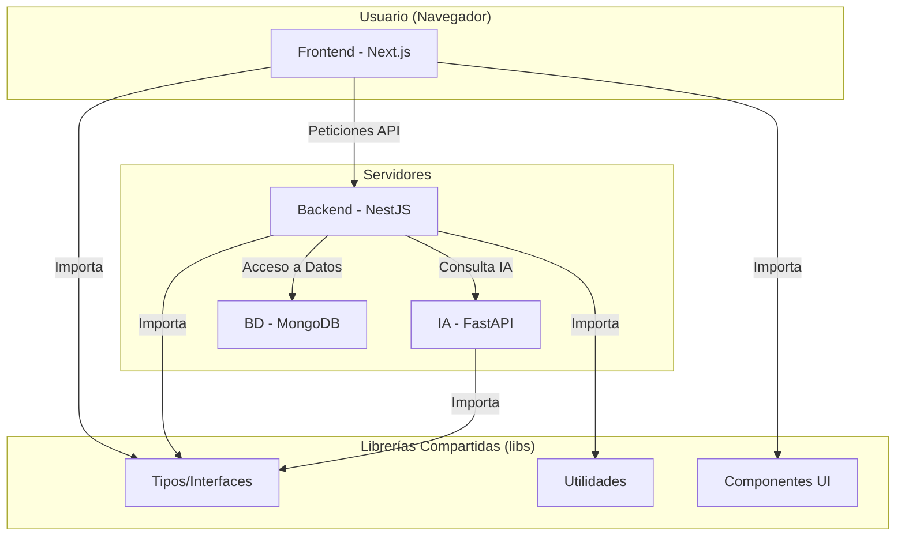

# Documento de Diseño: Plataforma Conexus

## 1. Overview

La plataforma "Conexus" es una aplicación web construida sobre una arquitectura de monorepo para maximizar la compartición de código y la consistencia. Utiliza un stack moderno basado en TypeScript para frontend, backend y el microservicio de IA, asegurando robustez y una excelente experiencia de desarrollo. La infraestructura está diseñada para ser contenerizada con Docker, facilitando la portabilidad y el despliegue.

## 2. Arquitectura

### 2.1. Arquitectura de Alto Nivel (Monorepo Nx)



### 2.2. Stack Tecnológico

- **Arquitectura:** Monorepo con **Nx**
- **Gestor de Paquetes:** **pnpm**
- **Runtime:** Node.js con **TypeScript**
- **Frontend:** **Next.js** (React)
- **Backend:** **NestJS**
- **Microservicio IA:** **Python** con **FastAPI**
- **Base de Datos:** **MongoDB** con **Prisma ORM**
- **Contenerización:** **Docker** y **Docker Compose**
- **Calidad de Código:** ESLint, Prettier, Husky
- **CI/CD:** **GitHub Actions**

## 3. Componentes e Interfaces

### 3.1. Interfaces Principales (Shared Lib)

```typescript
// libs/shared/types/src/index.ts

export interface User {
  id: string;
  email: string;
  role: 'FREELANCER' | 'RECRUITER';
  freelancerProfile?: FreelancerProfile;
  recruiterProfile?: RecruiterProfile;
}

export interface FreelancerProfile {
  id: string;
  userId: string;
  firstName: string;
  lastName: string;
  skills: string[];
  experienceYears: number;
}

export interface JobPosting {
  id: string;
  recruiterId: string;
  title: string;
  description: string;
  requiredSkills: string[];
  status: 'OPEN' | 'CLOSED';
  testId?: string;
}

// ... y otras interfaces como Test, Application, etc.
```

### 3.2. Estructura de Componentes (Directorios)

- **`apps/`**: Contiene las aplicaciones ejecutables.
  - **`apps/frontend`**: La aplicación Next.js.
  - **`apps/backend`**: La API de NestJS.
  - **`apps/ia-microservice`**: La API de FastAPI.
- **`libs/`**: Contiene las librerías de código compartido.
  - **`libs/shared/types`**: Interfaces y tipos de TypeScript.
  - **`libs/shared/ui`**: Componentes de React (UI) reutilizables.
  - **`libs/shared/utils`**: Funciones de utilidad comunes.

## 4. Modelos de Datos (Prisma)

### 4.1. Prisma Schema

```prisma
// apps/backend/prisma/schema.prisma
generator client {
  provider = "prisma-client-js"
}

datasource db {
  provider = "mongodb"
  url      = env("DATABASE_URL")
}

model User {
  id        String   @id @default(auto()) @map("_id") @db.ObjectId
  email     String   @unique
  password  String
  role      Role
  createdAt DateTime @default(now())
  updatedAt DateTime @updatedAt

  freelancerProfile FreelancerProfile? @relation(fields: [freelancerProfileId], references: [id])
  freelancerProfileId String? @unique @db.ObjectId

  recruiterProfile  RecruiterProfile? @relation(fields: [recruiterProfileId], references: [id])
  recruiterProfileId  String? @unique @db.ObjectId
}

model FreelancerProfile {
  id          String   @id @default(auto()) @map("_id") @db.ObjectId
  user        User?    
  firstName   String
  lastName    String
  skills      String[]
  experience  Int
  applications Application[]
}

model RecruiterProfile {
  id          String   @id @default(auto()) @map("_id") @db.ObjectId
  user        User?
  companyName String
  jobPostings JobPosting[]
  tests       Test[]
}

model JobPosting {
  id              String   @id @default(auto()) @map("_id") @db.ObjectId
  recruiter       RecruiterProfile @relation(fields: [recruiterProfileId], references: [id])
  recruiterProfileId String @db.ObjectId
  title           String
  description     String
  requiredSkills  String[]
  status          JobStatus @default(OPEN)
  applications    Application[]
  test            Test?      @relation(fields: [testId], references: [id])
  testId          String?    @db.ObjectId
}

model Test {
  id          String   @id @default(auto()) @map("_id") @db.ObjectId
  recruiter   RecruiterProfile @relation(fields: [recruiterProfileId], references: [id])
  recruiterProfileId String @db.ObjectId
  title       String
  questions   Question[]
  jobPosting  JobPosting?
}

model Question {
  id            String   @id @default(auto()) @map("_id") @db.ObjectId
  test          Test     @relation(fields: [testId], references: [id])
  testId        String   @db.ObjectId
  text          String
  options       String[]
  correctAnswer String
}

model Application {
  id            String   @id @default(auto()) @map("_id") @db.ObjectId
  freelancer    FreelancerProfile @relation(fields: [freelancerProfileId], references: [id])
  freelancerProfileId String @db.ObjectId
  jobPosting    JobPosting @relation(fields: [jobPostingId], references: [id])
  jobPostingId  String   @db.ObjectId
  status        ApplicationStatus @default(APPLIED)
  score         Float?
}

enum Role { FREELANCER RECRUITER ADMIN }
enum JobStatus { OPEN CLOSED }
enum ApplicationStatus { APPLIED TEST_PENDING TEST_COMPLETED MATCHED REJECTED HIRED }
```

## 5. Estrategia de Pruebas

### 5.1. Pruebas Unitarias
- **Backend:** Se probarán los `services` de NestJS en aislamiento, mockeando las dependencias (como el cliente de Prisma).
- **Frontend:** Se probarán los componentes de UI de forma aislada con `@testing-library/react`, verificando que renderizan la información correcta según las props.

### 5.2. Pruebas de Integración
- **Backend:** Se probarán los `controllers` de NestJS, haciendo peticiones HTTP a los endpoints y verificando que la interacción con la base de datos (usando una base de datos de prueba) es correcta.
- **Frontend:** Se probarán flujos de usuario que involucran múltiples componentes (ej. el flujo de login), mockeando las respuestas de la API.

### 5.3. Pruebas End-to-End (E2E)
- Se utilizará **Playwright** para simular la interacción de un usuario real en el navegador, cubriendo los flujos críticos como el registro, postulación a una oferta y completado de un test.
